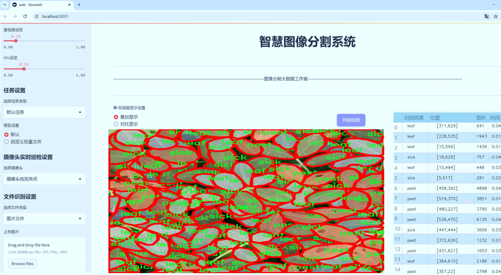
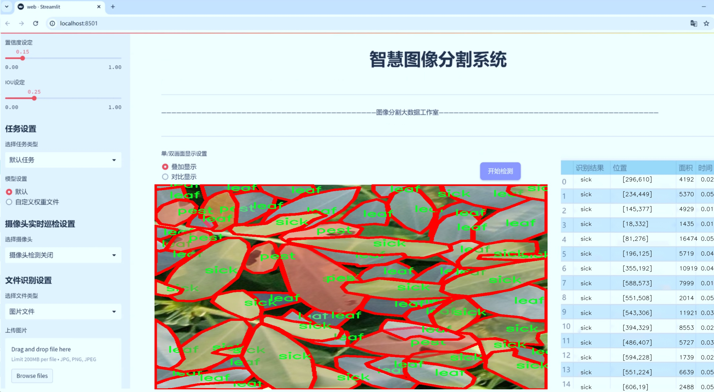
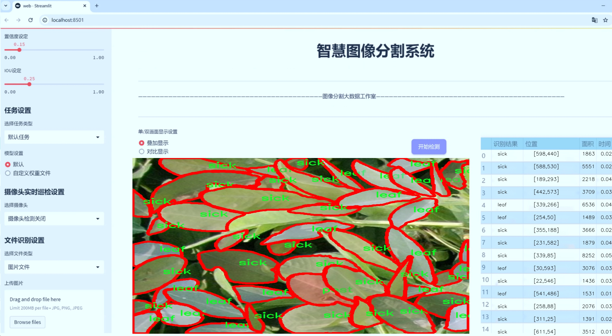
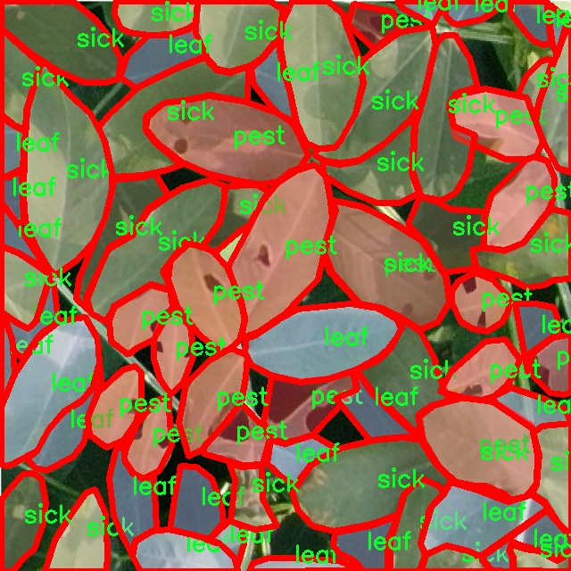
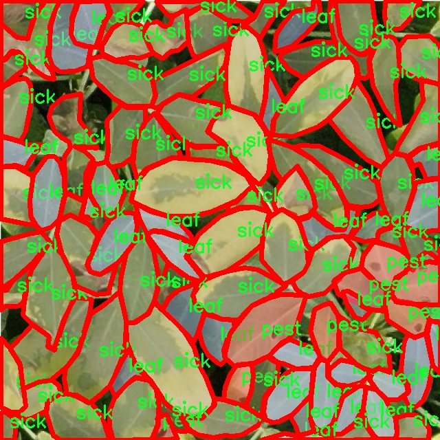
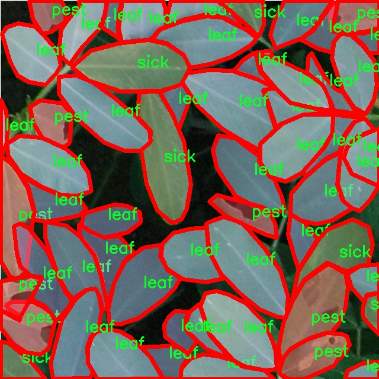
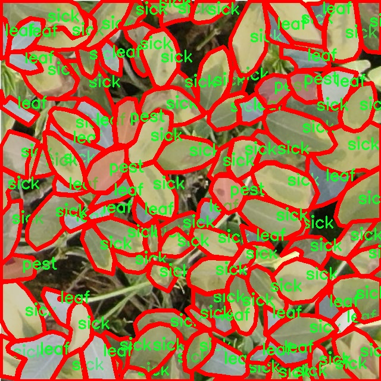
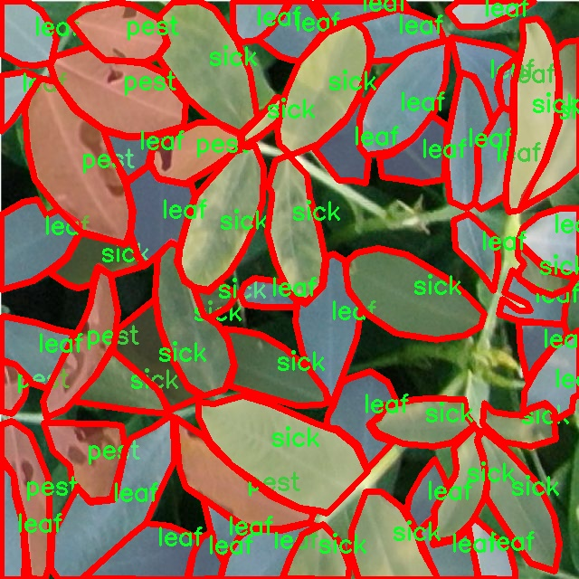

# 植物叶片健康状态分割系统： yolov8-seg-C2f-ODConv

### 1.研究背景与意义

[参考博客](https://gitee.com/YOLOv8_YOLOv11_Segmentation_Studio/projects)

[博客来源](https://kdocs.cn/l/cszuIiCKVNis)

研究背景与意义

随着全球人口的不断增长和城市化进程的加快，农业生产面临着前所未有的挑战。植物健康状况的监测与管理已成为确保农业可持续发展的重要课题。传统的植物健康检测方法多依赖于人工观察和经验判断，效率低下且容易受到主观因素的影响。因此，利用计算机视觉和深度学习技术对植物叶片进行自动化健康状态评估，具有重要的现实意义和应用前景。

近年来，卷积神经网络（CNN）在图像处理领域取得了显著进展，尤其是在目标检测和分割任务中表现出色。YOLO（You Only Look Once）系列模型因其高效的实时检测能力而广受欢迎。YOLOv8作为该系列的最新版本，进一步提升了模型的精度和速度，使其在复杂环境下的应用更加广泛。然而，针对植物叶片健康状态的特定需求，YOLOv8仍存在一些改进空间。为此，基于YOLOv8的改进版本，结合植物叶片的特征，构建一个高效的健康状态分割系统，将为农业生产提供新的解决方案。

本研究将利用名为“leafmeaug”的数据集，该数据集包含2500张图像，涵盖了三类重要的植物叶片状态：健康叶片、受害虫侵扰的叶片和病态叶片。这些数据不仅为模型的训练提供了丰富的样本，也为后续的性能评估奠定了基础。通过对这些图像进行实例分割，系统能够精确识别不同类别的叶片状态，从而实现对植物健康状况的实时监测。

研究的意义不仅在于提升植物健康状态的检测精度，更在于推动智能农业的发展。通过构建基于改进YOLOv8的植物叶片健康状态分割系统，能够为农民提供及时、准确的病虫害预警，帮助他们采取相应的防治措施，减少农药的使用，降低生产成本，提高作物产量和质量。此外，该系统还可以为农业科研提供数据支持，促进植物病理学和生态学的研究，推动相关领域的科学进步。

总之，基于改进YOLOv8的植物叶片健康状态分割系统的研究，不仅具有重要的理论价值，还具备广泛的应用前景。通过实现对植物健康状态的高效监测与管理，能够为农业可持续发展提供强有力的技术支持，助力实现智慧农业的愿景。这一研究将为未来的农业生产模式转型提供新的思路，推动农业与科技的深度融合，为应对全球粮食安全问题贡献力量。

### 2.图片演示







注意：本项目提供完整的训练源码数据集和训练教程,由于此博客编辑较早,暂不提供权重文件（best.pt）,需要按照6.训练教程进行训练后实现上图效果。

### 3.视频演示

[3.1 视频演示](https://www.bilibili.com/video/BV1orzhYXEyw/)

### 4.数据集信息

##### 4.1 数据集类别数＆类别名

nc: 3
names: ['leaf', 'pest', 'sick']


##### 4.2 数据集信息简介

数据集信息展示

在植物健康监测和病虫害防治的研究中，叶片的健康状态分割显得尤为重要。为此，我们构建了一个名为“leafmeaug”的数据集，旨在为改进YOLOv8-seg模型提供高质量的训练数据，以实现对植物叶片健康状态的精准分割和识别。该数据集专注于三种主要类别：健康叶片、受害叶片和病叶，分别对应于“leaf”、“pest”和“sick”这三种标签。这些类别的选择基于植物病虫害的常见类型，能够有效反映出植物在生长过程中可能面临的健康威胁。

“leafmeaug”数据集包含大量的高分辨率图像，涵盖了不同植物种类的叶片，确保了数据的多样性和代表性。每一张图像都经过精心标注，确保每个类别的区域都被准确地分割出来。这种细致的标注不仅为模型训练提供了必要的监督信号，也为后续的模型评估和性能验证奠定了基础。数据集中包含的健康叶片样本展现了植物在最佳生长状态下的特征，而受害叶片和病叶样本则展示了病虫害对植物造成的不同影响，帮助模型学习到如何区分健康与不健康的叶片。

在数据集的构建过程中，我们特别关注了图像的多样性和真实场景的还原。数据集中不仅包含了不同光照条件下拍摄的叶片图像，还涵盖了不同生长阶段的植物，确保模型能够适应各种实际应用场景。此外，数据集还考虑到了不同的拍摄角度和背景，进一步增强了模型的鲁棒性。这种多样化的设计理念使得“leafmeaug”数据集不仅适用于特定的植物种类，也能为其他植物的健康监测提供参考。

为了提高模型的泛化能力，我们在数据集中引入了一些数据增强技术。这些技术包括随机裁剪、旋转、颜色调整等，旨在模拟真实环境中可能遇到的各种情况。这种增强策略不仅丰富了数据集的内容，也为模型提供了更为广泛的学习机会，帮助其在面对未知数据时依然能够保持良好的识别性能。

在数据集的使用过程中，研究人员可以利用“leafmeaug”数据集进行模型的训练和调优。通过对YOLOv8-seg模型的改进，我们期望能够实现更高的分割精度和更快的推理速度，从而为植物健康监测提供更为有效的技术支持。随着深度学习技术的不断发展，我们相信“leafmeaug”数据集将为植物病虫害的自动检测和管理提供强有力的支持，推动农业智能化的发展。

总之，“leafmeaug”数据集的构建不仅为植物叶片健康状态的研究提供了丰富的数据资源，也为相关领域的研究者提供了一个良好的平台，以便在实际应用中实现更高效的植物健康监测和管理。随着数据集的不断完善和模型的持续优化，我们期待在未来能够看到更多基于此数据集的创新研究成果，为全球农业的可持续发展贡献力量。











### 5.项目依赖环境部署教程（零基础手把手教学）

[5.1 环境部署教程链接（零基础手把手教学）](https://www.bilibili.com/video/BV1jG4Ve4E9t/?vd_source=bc9aec86d164b67a7004b996143742dc)


[5.2 安装Python虚拟环境创建和依赖库安装视频教程链接（零基础手把手教学）](https://www.bilibili.com/video/BV1nA4VeYEze/?vd_source=bc9aec86d164b67a7004b996143742dc)

### 6.手把手YOLOV8-seg训练视频教程（零基础手把手教学）

[6.1 手把手YOLOV8-seg训练视频教程（零基础小白有手就能学会）](https://www.bilibili.com/video/BV1cA4VeYETe/?vd_source=bc9aec86d164b67a7004b996143742dc)


按照上面的训练视频教程链接加载项目提供的数据集，运行train.py即可开始训练



     Epoch   gpu_mem       box       obj       cls    labels  img_size
     1/200     0G   0.01576   0.01955  0.007536        22      1280: 100%|██████████| 849/849 [14:42<00:00,  1.04s/it]
               Class     Images     Labels          P          R     mAP@.5 mAP@.5:.95: 100%|██████████| 213/213 [01:14<00:00,  2.87it/s]
                 all       3395      17314      0.994      0.957      0.0957      0.0843

     Epoch   gpu_mem       box       obj       cls    labels  img_size
     2/200     0G   0.01578   0.01923  0.007006        22      1280: 100%|██████████| 849/849 [14:44<00:00,  1.04s/it]
               Class     Images     Labels          P          R     mAP@.5 mAP@.5:.95: 100%|██████████| 213/213 [01:12<00:00,  2.95it/s]
                 all       3395      17314      0.996      0.956      0.0957      0.0845

     Epoch   gpu_mem       box       obj       cls    labels  img_size
     3/200     0G   0.01561    0.0191  0.006895        27      1280: 100%|██████████| 849/849 [10:56<00:00,  1.29it/s]
               Class     Images     Labels          P          R     mAP@.5 mAP@.5:.95: 100%|███████   | 187/213 [00:52<00:00,  4.04it/s]
                 all       3395      17314      0.996      0.957      0.0957      0.0845


### 7.50+种全套YOLOV8-seg创新点加载调参实验视频教程（一键加载写好的改进模型的配置文件）

[7.1 50+种全套YOLOV8-seg创新点加载调参实验视频教程（一键加载写好的改进模型的配置文件）](https://www.bilibili.com/video/BV1Hw4VePEXv/?vd_source=bc9aec86d164b67a7004b996143742dc)

### YOLOV8-seg算法简介

原始YOLOv8-seg算法原理

YOLOv8-seg算法是YOLO系列目标检测模型中的最新进展，基于YOLOv5的基础上进行了多项创新和优化，旨在实现更高效的目标检测与分割任务。该算法不仅继承了YOLO系列模型的高效性和实时性，还通过引入新的模块和结构，提升了对复杂场景的适应能力和精度。YOLOv8-seg模型的核心结构主要由骨干特征提取网络、特征融合层和检测头层组成，每个部分都经过精心设计，以确保模型在性能和效率之间取得良好的平衡。

在骨干特征提取网络层，YOLOv8-seg采用了轻量化的C2F模块来替代原有的C3模块。C2F模块的设计灵感来源于YOLOv7中的ELAN结构，通过引入更多的跳层连接，增强了梯度流的丰富性。这种设计不仅提升了特征提取的效率，还确保了模型的轻量化，使得YOLOv8-seg能够在资源受限的环境中依然保持良好的性能。此外，C2F模块在卷积操作中使用了3×3的卷积核，深度则设置为3、6、6、3，这种结构的调整使得模型在提取特征时更加灵活和高效。

特征融合层是YOLOv8-seg的另一个重要组成部分。该层结合了特征金字塔网络（FPN）和路径聚合网络（PAN），并引入了BiFPN网络以进一步提升特征信息的提取速度。BiFPN网络的设计理念是实现高效的双向跨尺度连接，并通过加权特征融合来优化特征信息的流动。通过删除单输入对应的节点，BiFPN能够在同一层的输入输出节点之间建立连接，从而实现更为高效的特征融合。这种设计使得YOLOv8-seg在处理不同尺度的目标时，能够更好地捕捉到多层次的特征信息，提升了模型的检测精度。

在检测头层，YOLOv8-seg采用了解耦合头的结构，将分类和定位任务分开处理。这种结构的优势在于，分类任务可以专注于分析特征图中的类别信息，而定位任务则更关注边界框与真实框之间的关系。通过这种方式，模型在训练和推理过程中能够更快地收敛，并提高预测的精度。此外，YOLOv8-seg引入了无锚框结构，直接预测目标的中心位置，配合任务对齐学习（Task Alignment Learning）策略，进一步提升了分类和定位的效果。

在训练过程中，YOLOv8-seg对数据增强策略进行了优化。传统的马赛克数据增强虽然能够提升模型的鲁棒性，但在某些情况下也可能导致模型学习到不良信息。因此，YOLOv8-seg在训练的最后10个epoch中停止使用马赛克增强，以更好地保持数据的真实分布。此外，模型还采用了动态的样本分配策略，确保在训练过程中能够有效区分正负样本，提高模型的整体性能。

在损失函数的设计上，YOLOv8-seg采用了BCELoss作为分类损失，同时结合DFLLoss和CIoULoss作为回归损失。这种多损失函数的设计理念旨在通过不同的损失指标来引导模型的学习过程，使得模型在分类和定位任务上都能达到更高的精度。BCELoss主要用于衡量分类的准确性，而DFLLoss和CIoULoss则专注于边界框的回归精度，从而确保模型在复杂场景下的稳定性和可靠性。

综上所述，YOLOv8-seg算法通过一系列的结构优化和创新设计，成功地提升了目标检测与分割的性能。其轻量化的网络结构、有效的特征融合策略以及精细的损失函数设计，使得YOLOv8-seg在实时性和准确性之间找到了良好的平衡。这使得该算法在实际应用中，尤其是在需要快速响应和高精度的场景下，展现出了极大的潜力和应用价值。随着对YOLOv8-seg算法的深入研究和应用，未来在智能监控、自动驾驶、机器人视觉等领域，必将发挥更为重要的作用。


### 9.系统功能展示（检测对象为举例，实际内容以本项目数据集为准）

图9.1.系统支持检测结果表格显示

  图9.2.系统支持置信度和IOU阈值手动调节

  图9.3.系统支持自定义加载权重文件best.pt(需要你通过步骤5中训练获得)

  图9.4.系统支持摄像头实时识别

  图9.5.系统支持图片识别

  图9.6.系统支持视频识别

  图9.7.系统支持识别结果文件自动保存

  图9.8.系统支持Excel导出检测结果数据


### 10.50+种全套YOLOV8-seg创新点原理讲解（非科班也可以轻松写刊发刊，V11版本正在科研待更新）

#### 10.1 由于篇幅限制，每个创新点的具体原理讲解就不一一展开，具体见下列网址中的创新点对应子项目的技术原理博客网址【Blog】：


[10.1 50+种全套YOLOV8-seg创新点原理讲解链接](https://gitee.com/qunmasj/good)

#### 10.2 部分改进模块原理讲解(完整的改进原理见上图和技术博客链接)【如果此小节的图加载失败可以通过CSDN或者Github搜索该博客的标题访问原始博客，原始博客图片显示正常】
### YOLOv8简介
YOLOv8 尚未发表论文，因此我们无法直接了解其创建过程中进行的直接研究方法和消融研究。话虽如此，我们分析了有关模型的存储库和可用信息，以开始记录 YOLOv8 中的新功能。

如果您想自己查看代码，请查看YOLOv8 存储库并查看此代码差异以了解一些研究是如何完成的。

在这里，我们提供了有影响力的模型更新的快速总结，然后我们将查看模型的评估，这不言自明。

GitHub 用户 RangeKing 制作的下图显示了网络架构的详细可视化。


在这里插入图片描述


在这里插入图片描述

YOLOv8 架构，GitHub 用户 RangeKing 制作的可视化

无锚检测
YOLOv8 是一个无锚模型。这意味着它直接预测对象的中心而不是已知锚框的偏移量。


YOLO中anchor box的可视化

锚框是早期 YOLO 模型中众所周知的棘手部分，因为它们可能代表目标基准框的分布，而不是自定义数据集的分布。


YOLOv8 的检测头，在netron.app中可视化

Anchor free 检测减少了框预测的数量，从而加速了非最大抑制 (NMS)，这是一个复杂的后处理步骤，在推理后筛选候选检测。


YOLOv8 的检测头，在netron.app中可视化

新的卷积
stem 的第一个6x6conv 被替换为 a 3x3，主要构建块被更改，并且C2f替换了C3。该模块总结如下图，其中“f”是特征数，“e”是扩展率，CBS是由a Conv、a BatchNorm、a组成的block SiLU。

在中， （两个具有剩余连接的 3x3C2f的奇特名称）的所有输出都被连接起来。而在仅使用最后一个输出。Bottleneck``convs``C3``Bottleneck


新的 YOLOv8C2f模块

这Bottleneck与 YOLOv5 中的相同，但第一个 conv 的内核大小从更改1x1为3x3. 从这些信息中，我们可以看到 YOLOv8 开始恢复到 2015 年定义的 ResNet 块。

在颈部，特征直接连接而不强制使用相同的通道尺寸。这减少了参数数量和张量的整体大小。

### 空间和通道重建卷积SCConv
参考该博客提出的一种高效的卷积模块，称为SCConv (spatial and channel reconstruction convolution)，以减少冗余计算并促进代表性特征的学习。提出的SCConv由空间重构单元(SRU)和信道重构单元(CRU)两个单元组成。

（1）SRU根据权重分离冗余特征并进行重构，以抑制空间维度上的冗余，增强特征的表征。

（2）CRU采用分裂变换和融合策略来减少信道维度的冗余以及计算成本和存储。

（3）SCConv是一种即插即用的架构单元，可直接用于替代各种卷积神经网络中的标准卷积。实验结果表明，scconvo嵌入模型能够通过减少冗余特征来获得更好的性能，并且显著降低了复杂度和计算成本。


SCConv如图所示，它由两个单元组成，空间重建单元(SRU)和通道重建单元(CRU)，以顺序的方式放置。具体而言，对于瓶颈残差块中的中间输入特征X，首先通过SRU运算获得空间细化特征Xw，然后利用CRU运算获得信道细化特征Y。SCConv模块充分利用了特征之间的空间冗余和通道冗余，可以无缝集成到任何CNN架构中，以减少中间特征映射之间的冗余并增强CNN的特征表示。

#### SRU单元用于空间冗余


为了利用特征的空间冗余，引入了空间重构单元(SRU)，如图2所示，它利用了分离和重构操作。

分离操作 的目的是将信息丰富的特征图与空间内容对应的信息较少的特征图分离开来。我们利用组归一化(GN)层中的比例因子来评估不同特征图的信息内容。具体来说，给定一个中间特征映射X∈R N×C×H×W，首先通过减去平均值µ并除以标准差σ来标准化输入特征X，如下所示:


其中µ和σ是X的均值和标准差，ε是为了除法稳定性而加入的一个小的正常数，γ和β是可训练的仿射变换。

GN层中的可训练参数\gamma \in R^{C}用于测量每个批次和通道的空间像素方差。更丰富的空间信息反映了空间像素的更多变化，从而导致更大的γ。归一化相关权重W_{\gamma} \in R^{C}由下面公式2得到，表示不同特征映射的重要性。


然后将经Wγ重新加权的特征映射的权值通过sigmoid函数映射到(0,1)范围，并通过阈值进行门控。我们将阈值以上的权重设置为1，得到信息权重W1，将其设置为0，得到非信息权重W2(实验中阈值设置为0.5)。获取W的整个过程可以用公式表示。


最后将输入特征X分别乘以W1和W2，得到两个加权特征:信息量较大的特征X_{1}^{\omega }和信息量较小的特征X_{2}^{\omega }。这样就成功地将输入特征分为两部分:X_{1}^{\omega }具有信息量和表达性的空间内容，而X_{2}^{\omega }几乎没有信息，被认为是冗余的。

重构操作 将信息丰富的特征与信息较少的特征相加，生成信息更丰富的特征，从而节省空间空间。采用交叉重构运算，将加权后的两个不同的信息特征充分结合起来，加强它们之间的信息流。然后将交叉重构的特征X^{\omega1}和X^{\omega2}进行拼接，得到空间精细特征映射X^{\omega}。从后过程表示如下：


其中⊗是逐元素的乘法，⊕是逐元素的求和，∪是串联。将SRU应用于中间输入特征X后，不仅将信息特征与信息较少的特征分离，而且对其进行重构，增强代表性特征，抑制空间维度上的冗余特征。然而，空间精细特征映射X^{\omega}在通道维度上仍然是冗余的。

#### CRU单元用于通道冗余


分割 操作将输入的空间细化特征X^{\omega}分割成两个部分，一部分通道数是\alpha C，另一部分通道数是(1-\alpha) C，随后对两组特征的通道数使用1 * 1卷积核进行压缩，分别得到X_{up}和X_{low}。

转换 操作将输入的X_{up}作为“富特征提取”的输入，分别进行GWC和PWC，然后相加得到输出Y1，将输入X_{low}作为“富特征提取”的补充，进行PWC，得到的记过和原来的输入取并集得到Y2。

融合 操作使用简化的SKNet方法来自适应合并Y1和Y2。具体说是首先使用全局平均池化将全局空间信息和通道统计信息结合起来，得到经过池化的S1和S2。然后对S1和S2做Softmax得到特征权重向量\beta _{1}和\beta _{2}，最后使用特征权重向量得到输出Y = \beta _{1}*Y_{1} + \beta _{2}*Y_{2}，Y即为通道提炼的特征。


### 11.项目核心源码讲解（再也不用担心看不懂代码逻辑）

#### 11.1 ultralytics\models\yolo\segment\train.py

以下是对给定代码的核心部分进行提炼和详细注释的结果：

```python
# 导入必要的库和模块
from copy import copy
from ultralytics.models import yolo
from ultralytics.nn.tasks import SegmentationModel
from ultralytics.utils import DEFAULT_CFG, RANK
from ultralytics.utils.plotting import plot_images, plot_results

class SegmentationTrainer(yolo.detect.DetectionTrainer):
    """
    SegmentationTrainer类扩展了DetectionTrainer类，用于基于分割模型的训练。
    
    示例用法：
        ```python
        from ultralytics.models.yolo.segment import SegmentationTrainer

        args = dict(model='yolov8n-seg.pt', data='coco8-seg.yaml', epochs=3)
        trainer = SegmentationTrainer(overrides=args)
        trainer.train()
        ```
    """

    def __init__(self, cfg=DEFAULT_CFG, overrides=None, _callbacks=None):
        """初始化SegmentationTrainer对象，接受配置和覆盖参数。"""
        if overrides is None:
            overrides = {}
        overrides['task'] = 'segment'  # 设置任务类型为分割
        super().__init__(cfg, overrides, _callbacks)  # 调用父类构造函数

    def get_model(self, cfg=None, weights=None, verbose=True):
        """返回初始化的SegmentationModel，使用指定的配置和权重。"""
        # 创建SegmentationModel实例，ch为通道数，nc为类别数
        model = SegmentationModel(cfg, ch=3, nc=self.data['nc'], verbose=verbose and RANK == -1)
        if weights:
            model.load(weights)  # 如果提供了权重，则加载权重

        return model  # 返回模型实例

    def get_validator(self):
        """返回SegmentationValidator实例，用于YOLO模型的验证。"""
        self.loss_names = 'box_loss', 'seg_loss', 'cls_loss', 'dfl_loss'  # 定义损失名称
        # 创建并返回SegmentationValidator实例
        return yolo.segment.SegmentationValidator(self.test_loader, save_dir=self.save_dir, args=copy(self.args))

    def plot_training_samples(self, batch, ni):
        """创建训练样本图像的绘图，包括标签和边框坐标。"""
        plot_images(batch['img'],  # 图像数据
                    batch['batch_idx'],  # 批次索引
                    batch['cls'].squeeze(-1),  # 类别
                    batch['bboxes'],  # 边框
                    batch['masks'],  # 掩码
                    paths=batch['im_file'],  # 图像文件路径
                    fname=self.save_dir / f'train_batch{ni}.jpg',  # 保存路径
                    on_plot=self.on_plot)  # 绘图回调

    def plot_metrics(self):
        """绘制训练和验证指标的图表。"""
        plot_results(file=self.csv, segment=True, on_plot=self.on_plot)  # 保存结果图
```

### 代码核心部分说明：
1. **类定义**：`SegmentationTrainer`类继承自`DetectionTrainer`，用于处理分割任务的训练。
2. **初始化方法**：构造函数中设置任务类型为分割，并调用父类的构造函数。
3. **模型获取**：`get_model`方法用于创建和返回分割模型实例，并可选择加载预训练权重。
4. **验证器获取**：`get_validator`方法返回一个验证器实例，用于模型验证，并定义了损失名称。
5. **绘图方法**：`plot_training_samples`和`plot_metrics`方法用于可视化训练样本和训练指标，便于监控训练过程。

以上是对代码的核心部分和功能的详细注释。

这个文件是一个用于训练YOLO（You Only Look Once）模型进行图像分割的Python脚本，主要定义了一个名为`SegmentationTrainer`的类。该类继承自`DetectionTrainer`，专门用于处理图像分割任务。

在文件的开头，首先导入了一些必要的模块和类，包括`copy`模块、YOLO模型、分割模型、默认配置、排名以及绘图工具。这些导入的内容为后续的模型训练和结果可视化提供了支持。

`SegmentationTrainer`类的构造函数`__init__`接受配置参数`cfg`、覆盖参数`overrides`和回调函数`_callbacks`。如果没有提供覆盖参数，则会初始化为空字典。构造函数中将任务类型设置为“segment”，并调用父类的构造函数进行初始化。

`get_model`方法用于返回一个初始化的分割模型`SegmentationModel`，该模型根据提供的配置和权重进行设置。如果指定了权重，模型会加载这些权重。

`get_validator`方法返回一个`SegmentationValidator`实例，用于对YOLO模型进行验证。在这个方法中，还定义了损失名称，包括边界框损失、分割损失、分类损失和分布损失。

`plot_training_samples`方法用于绘制训练样本的图像，包括标签和边界框坐标。它接收一个批次的样本和批次索引，并生成一个包含图像和相关信息的图表，保存到指定的目录中。

最后，`plot_metrics`方法用于绘制训练和验证过程中的指标图。它调用`plot_results`函数，将结果保存为PNG格式的图像。

整体来看，这个文件的功能是为YOLO模型的图像分割任务提供一个训练框架，包含模型的初始化、验证、样本绘制和指标可视化等功能。通过这个类，用户可以方便地进行图像分割模型的训练和评估。

#### 11.2 ultralytics\nn\extra_modules\block.py

以下是保留的核心代码部分，并附上详细的中文注释：

```python
import torch
import torch.nn as nn
import torch.nn.functional as F

def autopad(k, p=None, d=1):  # kernel, padding, dilation
    """自动填充以实现'same'形状的输出。"""
    if d > 1:
        k = d * (k - 1) + 1 if isinstance(k, int) else [d * (x - 1) + 1 for x in k]  # 实际的卷积核大小
    if p is None:
        p = k // 2 if isinstance(k, int) else [x // 2 for x in k]  # 自动填充
    return p

class Conv(nn.Module):
    """标准卷积层，包含卷积、批归一化和激活函数。"""
    def __init__(self, in_channels, out_channels, kernel_size=3, stride=1, padding=None, groups=1, act=True):
        super().__init__()
        self.conv = nn.Conv2d(in_channels, out_channels, kernel_size, stride, autopad(kernel_size, padding), groups=groups, bias=False)
        self.bn = nn.BatchNorm2d(out_channels)
        self.act = nn.ReLU() if act is True else act  # 默认激活函数为ReLU

    def forward(self, x):
        """前向传播，依次通过卷积、批归一化和激活函数。"""
        return self.act(self.bn(self.conv(x)))

class Bottleneck(nn.Module):
    """标准瓶颈模块，包含两个卷积层和短接连接。"""
    def __init__(self, c1, c2, shortcut=True, g=1, k=(3, 3), e=0.5):
        super().__init__()
        c_ = int(c2 * e)  # 隐藏通道数
        self.cv1 = Conv(c1, c_, k[0], 1)  # 第一个卷积层
        self.cv2 = Conv(c_, c2, k[1], 1, g=g)  # 第二个卷积层
        self.add = shortcut and c1 == c2  # 是否使用短接连接

    def forward(self, x):
        """前向传播，计算输出并加上短接连接。"""
        return x + self.cv2(self.cv1(x)) if self.add else self.cv2(self.cv1(x))

class C3(nn.Module):
    """包含多个瓶颈模块的块。"""
    def __init__(self, c1, c2, n=1, shortcut=False, g=1, e=0.5):
        super().__init__()
        self.m = nn.Sequential(*(Bottleneck(c1, c2, shortcut, g, k=(3, 3), e=e) for _ in range(n)))  # n个瓶颈模块

    def forward(self, x):
        """前向传播，依次通过所有瓶颈模块。"""
        return self.m(x)

class DyHeadBlock(nn.Module):
    """动态头块，使用多种注意力机制。"""
    def __init__(self, in_channels, norm_type='GN', zero_init_offset=True):
        super().__init__()
        self.spatial_conv_offset = nn.Conv2d(in_channels, 9, 3, padding=1)  # 计算偏移量和掩码
        self.spatial_conv_high = Conv(in_channels, in_channels)  # 高层特征卷积
        self.spatial_conv_mid = Conv(in_channels, in_channels)  # 中层特征卷积
        self.spatial_conv_low = Conv(in_channels, in_channels, stride=2)  # 低层特征卷积

    def forward(self, x):
        """前向传播，计算不同层次的特征并进行融合。"""
        outs = []
        for level in range(len(x)):
            offset_and_mask = self.spatial_conv_offset(x[level])  # 计算偏移量和掩码
            mid_feat = self.spatial_conv_mid(x[level])  # 中层特征
            outs.append(mid_feat)  # 保存中层特征
        return outs

# 其他模块和类的定义省略...

```

### 代码说明：
1. **autopad**: 自动计算填充以确保卷积操作的输出形状与输入形状相同。
2. **Conv**: 自定义卷积层，包含卷积、批归一化和激活函数。
3. **Bottleneck**: 实现标准的瓶颈结构，通常用于深度学习模型中以减少参数数量。
4. **C3**: 由多个瓶颈模块组成的层，通常用于特征提取。
5. **DyHeadBlock**: 动态头块，利用不同层次的特征进行融合，通常用于目标检测任务。

### 注意事项：
- 以上代码片段中省略了一些类和方法的实现，具体实现可以根据需要进行扩展。
- 代码中使用了 PyTorch 框架，确保在运行时已安装相关库。

这个程序文件 `ultralytics\nn\extra_modules\block.py` 定义了一系列用于构建神经网络模块的类和函数，主要是针对卷积神经网络（CNN）中的不同结构和操作。以下是对文件内容的详细说明。

首先，文件导入了一些必要的库，包括 PyTorch 和一些自定义模块。接着，定义了一些常用的工具函数，比如 `autopad` 用于自动计算卷积的填充，以确保输出尺寸与输入相同。

接下来，文件中定义了多个神经网络模块的类。这些模块主要包括不同类型的卷积块、注意力机制、以及一些特定的结构，如 DyHead、Fusion、C2f、C3 等。每个模块通常由多个卷积层、激活函数、归一化层等组成，且有些模块还实现了残差连接以提高网络的训练效果。

例如，`DyHeadBlock` 类实现了一个动态头部块，使用了可调节的卷积和注意力机制，适用于目标检测等任务。`Fusion` 类则实现了不同输入特征图的融合操作，可以通过加权、拼接等方式进行特征融合。

此外，文件中还实现了一些复杂的结构，如 `C3_Faster` 和 `C2f_Faster`，这些结构通常用于提高模型的性能和效率。`Bottleneck` 类是一个常见的瓶颈结构，通常用于深度残差网络中，以减少参数数量和计算量。

文件中还定义了一些注意力机制的模块，如 `GSConv` 和 `RFAConv`，这些模块通过引入注意力机制来增强网络对重要特征的关注能力。

最后，文件还包含了一些特殊的模块，如 `GOLD-YOLO` 和 `EfficientNet-MBConv`，这些模块实现了特定的网络结构和操作，旨在提高模型的性能和效率。

总体而言，这个文件是一个复杂的神经网络模块库，包含了多种用于构建和优化卷积神经网络的工具和结构，适用于目标检测、图像分割等计算机视觉任务。

#### 11.3 ultralytics\utils\callbacks\raytune.py

以下是代码中最核心的部分，并附上详细的中文注释：

```python
# 导入必要的库和模块
from ultralytics.utils import SETTINGS

# 尝试导入Ray和Tune库，并验证Ray Tune集成是否启用
try:
    assert SETTINGS['raytune'] is True  # 验证Ray Tune集成是否启用
    import ray
    from ray import tune
    from ray.air import session
except (ImportError, AssertionError):
    tune = None  # 如果导入失败或集成未启用，则将tune设置为None

def on_fit_epoch_end(trainer):
    """在每个训练周期结束时，将训练指标发送到Ray Tune。"""
    if ray.tune.is_session_enabled():  # 检查Ray Tune会话是否启用
        metrics = trainer.metrics  # 获取当前训练指标
        metrics['epoch'] = trainer.epoch  # 将当前周期数添加到指标中
        session.report(metrics)  # 将指标报告给Ray Tune

# 定义回调函数，如果tune可用，则将on_fit_epoch_end添加到回调字典中
callbacks = {
    'on_fit_epoch_end': on_fit_epoch_end, 
} if tune else {}
```

### 代码注释说明：
1. **导入库**：首先导入了`SETTINGS`，用于检查Ray Tune的集成状态。
2. **异常处理**：使用`try`语句块来尝试导入Ray和Tune库，并验证Ray Tune是否启用。如果导入失败或集成未启用，则将`tune`设置为`None`。
3. **回调函数**：定义了`on_fit_epoch_end`函数，该函数在每个训练周期结束时被调用，用于将训练指标发送到Ray Tune。
4. **指标报告**：在回调函数中，首先检查Ray Tune会话是否启用，如果启用，则获取当前的训练指标，并将当前周期数添加到指标中，最后将这些指标报告给Ray Tune。
5. **回调字典**：根据`tune`的可用性，决定是否将`on_fit_epoch_end`函数添加到回调字典中。

这个程序文件是Ultralytics YOLO项目中的一个回调模块，主要用于与Ray Tune集成，以便在训练过程中监控和报告训练指标。文件的开头包含了版权信息，说明该代码遵循AGPL-3.0许可证。

首先，代码从`ultralytics.utils`模块导入了`SETTINGS`，这是一个配置字典，用于存储项目的各种设置。接下来，代码尝试检查`SETTINGS`中是否启用了Ray Tune集成，即`SETTINGS['raytune']`是否为`True`。如果启用，代码将导入Ray库及其相关模块，包括`tune`和`session`。如果导入失败或者集成未启用，`tune`将被设置为`None`，这意味着后续的回调功能将不可用。

接下来的函数`on_fit_epoch_end(trainer)`是一个回调函数，旨在训练每个epoch结束时向Ray Tune发送训练指标。函数首先检查Ray Tune的会话是否已启用，如果启用，则从`trainer`对象中获取当前的训练指标，并将当前的epoch编号添加到指标中。然后，使用`session.report(metrics)`将这些指标报告给Ray Tune，以便进行监控和分析。

最后，代码定义了一个字典`callbacks`，如果`tune`不为`None`（即Ray Tune集成可用），则将`on_fit_epoch_end`函数添加到字典中。这个字典可以在训练过程中用于注册回调函数，以便在特定事件发生时执行相应的操作。

总体而言，这个文件的主要功能是实现与Ray Tune的集成，以便在训练过程中有效地报告和监控训练指标，从而帮助用户优化模型性能。

#### 11.4 ultralytics\nn\modules\transformer.py

以下是代码中最核心的部分，并附上详细的中文注释：

```python
import torch
import torch.nn as nn
import torch.nn.functional as F

class TransformerEncoderLayer(nn.Module):
    """定义一个单层的Transformer编码器。"""

    def __init__(self, c1, cm=2048, num_heads=8, dropout=0.0, act=nn.GELU(), normalize_before=False):
        """初始化TransformerEncoderLayer，设置参数。"""
        super().__init__()
        self.ma = nn.MultiheadAttention(c1, num_heads, dropout=dropout, batch_first=True)  # 多头自注意力机制
        self.fc1 = nn.Linear(c1, cm)  # 前馈网络的第一层
        self.fc2 = nn.Linear(cm, c1)  # 前馈网络的第二层
        self.norm1 = nn.LayerNorm(c1)  # 第一层归一化
        self.norm2 = nn.LayerNorm(c1)  # 第二层归一化
        self.dropout = nn.Dropout(dropout)  # dropout层
        self.dropout1 = nn.Dropout(dropout)  # 第一层dropout
        self.dropout2 = nn.Dropout(dropout)  # 第二层dropout
        self.act = act  # 激活函数
        self.normalize_before = normalize_before  # 是否在前向传播前进行归一化

    def forward(self, src, src_mask=None, src_key_padding_mask=None, pos=None):
        """通过编码器模块进行前向传播。"""
        if self.normalize_before:
            return self.forward_pre(src, src_mask, src_key_padding_mask, pos)
        return self.forward_post(src, src_mask, src_key_padding_mask, pos)

    def forward_post(self, src, src_mask=None, src_key_padding_mask=None, pos=None):
        """后归一化的前向传播。"""
        q = k = self.with_pos_embed(src, pos)  # 计算查询和键
        src2 = self.ma(q, k, value=src, attn_mask=src_mask, key_padding_mask=src_key_padding_mask)[0]  # 自注意力计算
        src = src + self.dropout1(src2)  # 残差连接
        src = self.norm1(src)  # 归一化
        src2 = self.fc2(self.dropout(self.act(self.fc1(src))))  # 前馈网络
        src = src + self.dropout2(src2)  # 残差连接
        return self.norm2(src)  # 最终归一化

    @staticmethod
    def with_pos_embed(tensor, pos=None):
        """如果提供了位置嵌入，则将其添加到张量中。"""
        return tensor if pos is None else tensor + pos


class AIFI(TransformerEncoderLayer):
    """定义AIFI Transformer层。"""

    def forward(self, x):
        """AIFI Transformer层的前向传播。"""
        c, h, w = x.shape[1:]  # 获取输入的通道、高度和宽度
        pos_embed = self.build_2d_sincos_position_embedding(w, h, c)  # 构建2D位置嵌入
        x = super().forward(x.flatten(2).permute(0, 2, 1), pos=pos_embed.to(device=x.device, dtype=x.dtype))  # 前向传播
        return x.permute(0, 2, 1).view([-1, c, h, w]).contiguous()  # 恢复形状

    @staticmethod
    def build_2d_sincos_position_embedding(w, h, embed_dim=256, temperature=10000.0):
        """构建2D正弦余弦位置嵌入。"""
        grid_w = torch.arange(int(w), dtype=torch.float32)  # 水平网格
        grid_h = torch.arange(int(h), dtype=torch.float32)  # 垂直网格
        grid_w, grid_h = torch.meshgrid(grid_w, grid_h, indexing='ij')  # 创建网格
        pos_dim = embed_dim // 4  # 位置维度
        omega = torch.arange(pos_dim, dtype=torch.float32) / pos_dim  # 计算频率
        omega = 1. / (temperature ** omega)  # 温度缩放

        out_w = grid_w.flatten()[..., None] @ omega[None]  # 水平位置嵌入
        out_h = grid_h.flatten()[..., None] @ omega[None]  # 垂直位置嵌入

        return torch.cat([torch.sin(out_w), torch.cos(out_w), torch.sin(out_h), torch.cos(out_h)], 1)[None]  # 返回位置嵌入


class TransformerLayer(nn.Module):
    """Transformer层，使用线性变换和多头注意力机制。"""

    def __init__(self, c, num_heads):
        """初始化自注意力机制。"""
        super().__init__()
        self.q = nn.Linear(c, c, bias=False)  # 查询线性变换
        self.k = nn.Linear(c, c, bias=False)  # 键线性变换
        self.v = nn.Linear(c, c, bias=False)  # 值线性变换
        self.ma = nn.MultiheadAttention(embed_dim=c, num_heads=num_heads)  # 多头自注意力机制
        self.fc1 = nn.Linear(c, c, bias=False)  # 前馈网络的第一层
        self.fc2 = nn.Linear(c, c, bias=False)  # 前馈网络的第二层

    def forward(self, x):
        """应用Transformer块到输入x并返回输出。"""
        x = self.ma(self.q(x), self.k(x), self.v(x))[0] + x  # 自注意力计算和残差连接
        return self.fc2(self.fc1(x)) + x  # 前馈网络和残差连接


class MLPBlock(nn.Module):
    """实现多层感知机的单个块。"""

    def __init__(self, embedding_dim, mlp_dim, act=nn.GELU):
        """初始化MLPBlock。"""
        super().__init__()
        self.lin1 = nn.Linear(embedding_dim, mlp_dim)  # 第一层线性变换
        self.lin2 = nn.Linear(mlp_dim, embedding_dim)  # 第二层线性变换
        self.act = act()  # 激活函数

    def forward(self, x: torch.Tensor) -> torch.Tensor:
        """MLPBlock的前向传播。"""
        return self.lin2(self.act(self.lin1(x)))  # 前向传播


class MLP(nn.Module):
    """实现简单的多层感知机（也称为FFN）。"""

    def __init__(self, input_dim, hidden_dim, output_dim, num_layers):
        """初始化MLP。"""
        super().__init__()
        self.num_layers = num_layers
        h = [hidden_dim] * (num_layers - 1)  # 隐藏层维度
        self.layers = nn.ModuleList(nn.Linear(n, k) for n, k in zip([input_dim] + h, h + [output_dim]))  # 线性层列表

    def forward(self, x):
        """整个MLP的前向传播。"""
        for i, layer in enumerate(self.layers):
            x = F.relu(layer(x)) if i < self.num_layers - 1 else layer(x)  # ReLU激活
        return x  # 返回输出


class DeformableTransformerDecoderLayer(nn.Module):
    """可变形Transformer解码器层。"""

    def __init__(self, d_model=256, n_heads=8, d_ffn=1024, dropout=0., act=nn.ReLU(), n_levels=4, n_points=4):
        """初始化DeformableTransformerDecoderLayer。"""
        super().__init__()
        self.self_attn = nn.MultiheadAttention(d_model, n_heads, dropout=dropout)  # 自注意力机制
        self.cross_attn = MSDeformAttn(d_model, n_levels, n_heads, n_points)  # 跨注意力机制
        self.linear1 = nn.Linear(d_model, d_ffn)  # 前馈网络的第一层
        self.act = act  # 激活函数
        self.linear2 = nn.Linear(d_ffn, d_model)  # 前馈网络的第二层

    def forward(self, embed, refer_bbox, feats, shapes, padding_mask=None, attn_mask=None, query_pos=None):
        """通过整个解码器层进行前向传播。"""
        # 自注意力
        q = k = self.with_pos_embed(embed, query_pos)  # 计算查询和键
        tgt = self.self_attn(q.transpose(0, 1), k.transpose(0, 1), embed.transpose(0, 1), attn_mask=attn_mask)[0].transpose(0, 1)  # 自注意力计算
        embed = embed + tgt  # 残差连接

        # 跨注意力
        tgt = self.cross_attn(self.with_pos_embed(embed, query_pos), refer_bbox.unsqueeze(2), feats, shapes, padding_mask)  # 跨注意力计算
        embed = embed + tgt  # 残差连接

        # 前馈网络
        tgt2 = self.linear2(self.act(self.linear1(embed)))  # 前馈网络
        return embed + tgt2  # 残差连接

    @staticmethod
    def with_pos_embed(tensor, pos):
        """将位置嵌入添加到输入张量中（如果提供）。"""
        return tensor if pos is None else tensor + pos
```

### 代码核心部分说明：
1. **TransformerEncoderLayer**: 这是Transformer编码器的核心层，包含多头自注意力机制和前馈网络。支持前归一化和后归一化两种模式。
2. **AIFI**: 这是一个特定的Transformer层，增加了2D位置嵌入的构建。
3. **TransformerLayer**: 这是一个基本的Transformer层，包含自注意力和前馈网络。
4. **MLPBlock**和**MLP**: 实现了多层感知机，通常用于特征转换。
5. **DeformableTransformerDecoderLayer**: 这是可变形Transformer解码器的核心层，结合了自注意力和跨注意力机制。

这些核心部分构成了Transformer架构的基础，广泛应用于计算机视觉和自然语言处理等领域。

这个程序文件定义了一些与Transformer相关的模块，主要用于实现Ultralytics YOLO（You Only Look Once）模型中的Transformer结构。文件中包含多个类，每个类实现了特定的功能，主要包括Transformer编码器层、解码器层、注意力机制、MLP（多层感知器）等。

首先，`TransformerEncoderLayer`类定义了Transformer编码器的单层结构。它包含多头自注意力机制和前馈神经网络。构造函数中初始化了必要的参数，如输入通道数、隐藏层大小、头数、丢弃率等。`forward`方法根据是否使用预归一化来选择不同的前向传播方式。该类还实现了位置嵌入的添加功能。

接下来，`AIFI`类继承自`TransformerEncoderLayer`，用于实现特定的Transformer层。它在前向传播中构建了2D的正弦余弦位置嵌入，并将输入张量展平以适应Transformer的输入格式。

`TransformerLayer`类实现了一个基本的Transformer层，使用线性变换和多头注意力机制。其前向传播方法将输入经过自注意力机制和前馈网络处理后返回结果。

`TransformerBlock`类实现了一个完整的Transformer模块，支持位置嵌入和多个层的堆叠。它在前向传播中处理输入并返回经过多个Transformer层处理后的结果。

`MLPBlock`和`MLP`类实现了多层感知器的结构，前者是单个MLP块，后者则是多个层的组合，支持前向传播。

`LayerNorm2d`类实现了2D层归一化，主要用于在图像数据上进行归一化处理，以提高模型的稳定性和收敛速度。

`MSDeformAttn`类实现了多尺度可变形注意力机制，支持在不同尺度上进行特征提取。它的前向传播方法处理查询、参考边界框、值和形状信息，返回经过注意力机制处理后的输出。

`DeformableTransformerDecoderLayer`和`DeformableTransformerDecoder`类实现了可变形Transformer解码器的结构。解码器层包括自注意力和交叉注意力机制，并在前向传播中处理输入特征和参考边界框。解码器类则将多个解码器层组合在一起，支持前向传播并返回解码后的边界框和分类结果。

总体来说，这个文件实现了YOLO模型中使用的Transformer结构，提供了多种注意力机制和前馈网络的实现，旨在提高目标检测的性能和效率。

#### 11.5 ultralytics\utils\callbacks\tensorboard.py

以下是代码中最核心的部分，并附上详细的中文注释：

```python
# 导入必要的库
from ultralytics.utils import LOGGER, SETTINGS, TESTS_RUNNING, colorstr

try:
    # 尝试导入TensorBoard的SummaryWriter
    from torch.utils.tensorboard import SummaryWriter

    # 确保当前不是在运行测试
    assert not TESTS_RUNNING  
    # 确保TensorBoard集成已启用
    assert SETTINGS['tensorboard'] is True  
    WRITER = None  # 初始化TensorBoard的SummaryWriter实例

except (ImportError, AssertionError, TypeError):
    # 处理导入错误或断言错误
    SummaryWriter = None  # 如果导入失败，则将SummaryWriter设置为None


def _log_scalars(scalars, step=0):
    """将标量值记录到TensorBoard中。"""
    if WRITER:  # 如果WRITER已初始化
        for k, v in scalars.items():  # 遍历标量字典
            WRITER.add_scalar(k, v, step)  # 记录每个标量


def _log_tensorboard_graph(trainer):
    """将模型图记录到TensorBoard中。"""
    try:
        import warnings
        from ultralytics.utils.torch_utils import de_parallel, torch

        imgsz = trainer.args.imgsz  # 获取输入图像大小
        imgsz = (imgsz, imgsz) if isinstance(imgsz, int) else imgsz  # 确保图像大小为元组
        p = next(trainer.model.parameters())  # 获取模型参数以确定设备和类型
        im = torch.zeros((1, 3, *imgsz), device=p.device, dtype=p.dtype)  # 创建一个零填充的输入图像
        with warnings.catch_warnings():
            warnings.simplefilter('ignore', category=UserWarning)  # 忽略JIT跟踪警告
            WRITER.add_graph(torch.jit.trace(de_parallel(trainer.model), im, strict=False), [])  # 记录模型图
    except Exception as e:
        LOGGER.warning(f'WARNING ⚠️ TensorBoard图形可视化失败 {e}')  # 记录警告信息


def on_pretrain_routine_start(trainer):
    """初始化TensorBoard记录，使用SummaryWriter。"""
    if SummaryWriter:  # 如果SummaryWriter可用
        try:
            global WRITER
            WRITER = SummaryWriter(str(trainer.save_dir))  # 创建SummaryWriter实例
            prefix = colorstr('TensorBoard: ')
            LOGGER.info(f"{prefix}开始使用 'tensorboard --logdir {trainer.save_dir}'，在 http://localhost:6006/ 查看。")
        except Exception as e:
            LOGGER.warning(f'WARNING ⚠️ TensorBoard未正确初始化，未记录此运行。 {e}')  # 记录警告信息


def on_train_start(trainer):
    """记录TensorBoard图形。"""
    if WRITER:  # 如果WRITER已初始化
        _log_tensorboard_graph(trainer)  # 记录模型图


def on_batch_end(trainer):
    """在训练批次结束时记录标量统计信息。"""
    _log_scalars(trainer.label_loss_items(trainer.tloss, prefix='train'), trainer.epoch + 1)  # 记录训练损失


def on_fit_epoch_end(trainer):
    """在训练周期结束时记录周期指标。"""
    _log_scalars(trainer.metrics, trainer.epoch + 1)  # 记录周期指标


# 定义回调函数字典，根据SummaryWriter是否可用来决定是否创建
callbacks = {
    'on_pretrain_routine_start': on_pretrain_routine_start,
    'on_train_start': on_train_start,
    'on_fit_epoch_end': on_fit_epoch_end,
    'on_batch_end': on_batch_end} if SummaryWriter else {}
```

### 代码说明：
1. **导入库**：导入了必要的库，包括`LOGGER`、`SETTINGS`等，用于日志记录和设置管理。
2. **TensorBoard初始化**：尝试导入`SummaryWriter`，并进行必要的检查，确保在非测试模式下且TensorBoard集成已启用。
3. **记录标量**：定义了一个函数`_log_scalars`，用于将标量数据记录到TensorBoard。
4. **记录模型图**：定义了`_log_tensorboard_graph`函数，记录模型的计算图，以便在TensorBoard中可视化。
5. **回调函数**：定义了一系列回调函数，在训练的不同阶段（如预训练开始、训练开始、批次结束、周期结束）进行相应的记录操作。
6. **回调字典**：根据`SummaryWriter`的可用性，创建一个回调函数字典，以便在训练过程中调用。

这个程序文件是一个用于集成 TensorBoard 的回调模块，主要用于在训练过程中记录和可视化模型的训练状态和性能指标。首先，文件导入了一些必要的模块和工具，包括日志记录器、设置和颜色字符串等。接着，它尝试导入 `torch.utils.tensorboard` 中的 `SummaryWriter`，这是 TensorBoard 的核心组件，用于记录标量、图形等信息。

在导入过程中，程序会进行一些检查，确保在运行测试时不会记录日志，并且确认 TensorBoard 集成已启用。如果导入失败或出现错误（例如在 Windows 上的 protobuf 错误），则将 `SummaryWriter` 设置为 `None`，以避免后续调用时出错。

接下来，定义了几个函数来处理不同的日志记录任务。`_log_scalars` 函数用于将标量值记录到 TensorBoard，接收一个字典形式的标量和当前步数作为参数。`_log_tensorboard_graph` 函数则用于记录模型的计算图，它会创建一个输入张量并使用 `torch.jit.trace` 来生成模型的图形表示，同时捕获可能出现的警告。

文件中还定义了一些回调函数，分别在不同的训练阶段被调用。`on_pretrain_routine_start` 函数在预训练开始时初始化 TensorBoard 的日志记录，创建 `SummaryWriter` 实例并输出相关信息。`on_train_start` 函数在训练开始时调用 `_log_tensorboard_graph` 函数来记录模型图。`on_batch_end` 和 `on_fit_epoch_end` 函数分别在每个训练批次结束和每个训练周期结束时记录标量统计信息。

最后，程序将这些回调函数组织成一个字典，只有在成功导入 `SummaryWriter` 的情况下才会创建这个字典，以便在训练过程中根据需要调用相应的回调函数。整体上，这个模块为 YOLO 模型的训练过程提供了一个结构化的 TensorBoard 日志记录机制，便于用户监控和分析模型的训练情况。

### 12.系统整体结构（节选）

### 程序整体功能和构架概括

该程序是Ultralytics YOLO项目的一部分，主要用于实现和训练YOLO模型，特别是针对目标检测和图像分割任务。整体架构包括多个模块，涵盖了模型的构建、训练、验证、日志记录和可视化等功能。以下是各个模块的主要功能：

1. **模型训练**：`train.py`文件定义了用于训练YOLO分割模型的框架，处理模型的初始化、验证和训练样本的可视化。
2. **神经网络模块**：`block.py`文件实现了多种神经网络模块，包括卷积块、注意力机制和特定的网络结构，旨在提高模型的性能和效率。
3. **回调函数**：`raytune.py`文件实现了与Ray Tune的集成，允许在训练过程中监控和报告训练指标，以优化模型性能。
4. **Transformer模块**：`transformer.py`文件实现了与Transformer相关的结构，提供了编码器、解码器和注意力机制等功能，增强了YOLO模型的特征提取能力。
5. **TensorBoard集成**：`tensorboard.py`文件提供了与TensorBoard的集成，记录和可视化训练过程中的各种指标，帮助用户监控模型的训练状态。

### 文件功能整理表

| 文件路径                                              | 功能描述                                                   |
|-----------------------------------------------------|----------------------------------------------------------|
| `ultralytics/models/yolo/segment/train.py`          | 定义YOLO分割模型的训练框架，包括模型初始化、验证和样本可视化。 |
| `ultralytics/nn/extra_modules/block.py`             | 实现多种神经网络模块，包括卷积块、注意力机制和特定网络结构。   |
| `ultralytics/utils/callbacks/raytune.py`            | 实现与Ray Tune的集成，监控和报告训练指标以优化模型性能。      |
| `ultralytics/nn/modules/transformer.py`             | 实现Transformer相关结构，包括编码器、解码器和注意力机制。     |
| `ultralytics/utils/callbacks/tensorboard.py`       | 提供与TensorBoard的集成，记录和可视化训练过程中的指标。       |

通过这些模块的协同工作，Ultralytics YOLO项目能够高效地进行目标检测和图像分割任务，同时提供丰富的可视化和监控工具，帮助用户优化模型性能。

### 13.图片、视频、摄像头图像分割Demo(去除WebUI)代码

在这个博客小节中，我们将讨论如何在不使用WebUI的情况下，实现图像分割模型的使用。本项目代码已经优化整合，方便用户将分割功能嵌入自己的项目中。
核心功能包括图片、视频、摄像头图像的分割，ROI区域的轮廓提取、类别分类、周长计算、面积计算、圆度计算以及颜色提取等。
这些功能提供了良好的二次开发基础。

### 核心代码解读

以下是主要代码片段，我们会为每一块代码进行详细的批注解释：

```python
import random
import cv2
import numpy as np
from PIL import ImageFont, ImageDraw, Image
from hashlib import md5
from model import Web_Detector
from chinese_name_list import Label_list

# 根据名称生成颜色
def generate_color_based_on_name(name):
    ......

# 计算多边形面积
def calculate_polygon_area(points):
    return cv2.contourArea(points.astype(np.float32))

...
# 绘制中文标签
def draw_with_chinese(image, text, position, font_size=20, color=(255, 0, 0)):
    image_pil = Image.fromarray(cv2.cvtColor(image, cv2.COLOR_BGR2RGB))
    draw = ImageDraw.Draw(image_pil)
    font = ImageFont.truetype("simsun.ttc", font_size, encoding="unic")
    draw.text(position, text, font=font, fill=color)
    return cv2.cvtColor(np.array(image_pil), cv2.COLOR_RGB2BGR)

# 动态调整参数
def adjust_parameter(image_size, base_size=1000):
    max_size = max(image_size)
    return max_size / base_size

# 绘制检测结果
def draw_detections(image, info, alpha=0.2):
    name, bbox, conf, cls_id, mask = info['class_name'], info['bbox'], info['score'], info['class_id'], info['mask']
    adjust_param = adjust_parameter(image.shape[:2])
    spacing = int(20 * adjust_param)

    if mask is None:
        x1, y1, x2, y2 = bbox
        aim_frame_area = (x2 - x1) * (y2 - y1)
        cv2.rectangle(image, (x1, y1), (x2, y2), color=(0, 0, 255), thickness=int(3 * adjust_param))
        image = draw_with_chinese(image, name, (x1, y1 - int(30 * adjust_param)), font_size=int(35 * adjust_param))
        y_offset = int(50 * adjust_param)  # 类别名称上方绘制，其下方留出空间
    else:
        mask_points = np.concatenate(mask)
        aim_frame_area = calculate_polygon_area(mask_points)
        mask_color = generate_color_based_on_name(name)
        try:
            overlay = image.copy()
            cv2.fillPoly(overlay, [mask_points.astype(np.int32)], mask_color)
            image = cv2.addWeighted(overlay, 0.3, image, 0.7, 0)
            cv2.drawContours(image, [mask_points.astype(np.int32)], -1, (0, 0, 255), thickness=int(8 * adjust_param))

            # 计算面积、周长、圆度
            area = cv2.contourArea(mask_points.astype(np.int32))
            perimeter = cv2.arcLength(mask_points.astype(np.int32), True)
            ......

            # 计算色彩
            mask = np.zeros(image.shape[:2], dtype=np.uint8)
            cv2.drawContours(mask, [mask_points.astype(np.int32)], -1, 255, -1)
            color_points = cv2.findNonZero(mask)
            ......

            # 绘制类别名称
            x, y = np.min(mask_points, axis=0).astype(int)
            image = draw_with_chinese(image, name, (x, y - int(30 * adjust_param)), font_size=int(35 * adjust_param))
            y_offset = int(50 * adjust_param)

            # 绘制面积、周长、圆度和色彩值
            metrics = [("Area", area), ("Perimeter", perimeter), ("Circularity", circularity), ("Color", color_str)]
            for idx, (metric_name, metric_value) in enumerate(metrics):
                ......

    return image, aim_frame_area

# 处理每帧图像
def process_frame(model, image):
    pre_img = model.preprocess(image)
    pred = model.predict(pre_img)
    det = pred[0] if det is not None and len(det)
    if det:
        det_info = model.postprocess(pred)
        for info in det_info:
            image, _ = draw_detections(image, info)
    return image

if __name__ == "__main__":
    cls_name = Label_list
    model = Web_Detector()
    model.load_model("./weights/yolov8s-seg.pt")

    # 摄像头实时处理
    cap = cv2.VideoCapture(0)
    while cap.isOpened():
        ret, frame = cap.read()
        if not ret:
            break
        ......

    # 图片处理
    image_path = './icon/OIP.jpg'
    image = cv2.imread(image_path)
    if image is not None:
        processed_image = process_frame(model, image)
        ......

    # 视频处理
    video_path = ''  # 输入视频的路径
    cap = cv2.VideoCapture(video_path)
    while cap.isOpened():
        ret, frame = cap.read()
        ......
```


### 14.完整训练+Web前端界面+50+种创新点源码、数据集获取


# [下载链接：https://mbd.pub/o/bread/Z5uVkpls](https://mbd.pub/o/bread/Z5uVkpls)